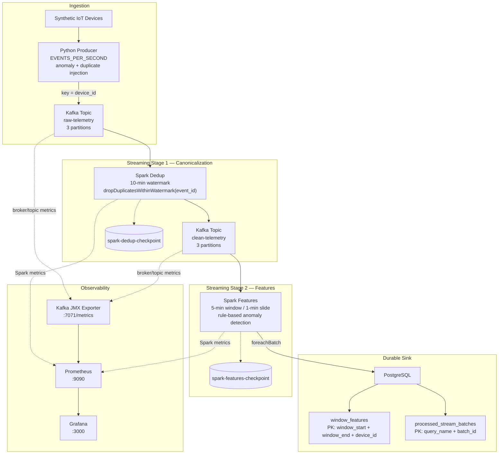
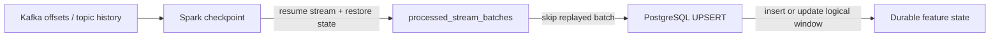
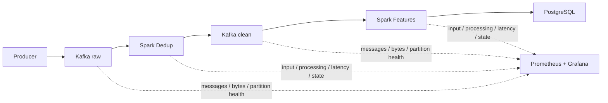

# Architecture

## Full pipeline



## Reliability model



The three mechanisms have separate responsibilities:

```text
Spark checkpoint
→ tracks streaming progress and state

processed_stream_batches
→ prevents a replayed Spark micro-batch from being committed twice

PostgreSQL UPSERT
→ ensures one logical row per device/window while active windows are updated
```

## Monitoring model



This gives visibility into **where** a slowdown occurs rather than only showing whether a container is alive.
