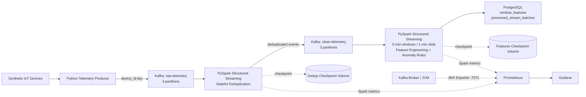

# Real-Time IoT Telemetry & Anomaly Detection Pipeline

A Dockerized streaming data-engineering project that simulates IoT telemetry, ingests it through Kafka, performs stateful deduplication and event-time feature engineering with PySpark Structured Streaming, writes idempotently to PostgreSQL, and exposes operational metrics through Prometheus and Grafana.

The project is intentionally focused on **streaming systems, reliability, stateful processing, observability, and data-engineering design** rather than building another ML-heavy application.

---

## What this project demonstrates

- Kafka ingestion with KRaft and partitioned topics
- Key-based partitioning for per-device ordering
- Stateful deduplication across Spark micro-batches
- Event-time processing and watermarks
- Sliding-window feature engineering
- Rule-based anomaly detection
- Spark checkpoint recovery
- Idempotent PostgreSQL writes with UPSERTs
- Micro-batch replay protection
- Docker Compose orchestration and persistent volumes
- Prometheus/Grafana observability
- Kafka JMX monitoring
- Progressive load testing

---

## Architecture



A more detailed monitoring and reliability diagram is available in [ARCHITECTURE.md](ARCHITECTURE.md).

---

## End-to-end data flow

```text
Synthetic IoT Devices
        ↓
Python Producer
        ↓
Kafka: raw-telemetry
        ↓
Spark Stateful Deduplication
        ↓
Kafka: clean-telemetry
        ↓
Spark Event-Time Windows + Features
        ↓
PostgreSQL
```

Observability runs alongside the pipeline:

```text
Spark metrics ───────┐
                     ├──> Prometheus ───> Grafana
Kafka JMX metrics ───┘
```

---

## Tech stack

| Layer | Technology |
|---|---|
| Event streaming | Apache Kafka 4.2, KRaft |
| Stream processing | Apache Spark / PySpark Structured Streaming 4.2 |
| Producer | Python + `confluent-kafka` |
| Database | PostgreSQL 17 |
| Monitoring | Prometheus |
| Dashboards | Grafana |
| Kafka metrics | Prometheus JMX Exporter |
| Orchestration | Docker Compose |

---

## Kafka design

Two Kafka topics are used:

```text
raw-telemetry
clean-telemetry
```

Each currently uses 3 partitions and replication factor 1. Replication factor 1 is intentional for the local single-broker development environment.

The producer uses:

```python
key=device_id
```

This means events for the same device are generally routed to the same partition, preserving Kafka's ordering guarantee **within that partition**.

---

## Telemetry events

Five simulated devices generate readings containing:

```json
{
  "event_id": "UUID",
  "device_id": "device_003",
  "event_time": "UTC timestamp",
  "temperature": 72.3,
  "vibration": 0.35,
  "voltage": 230.5,
  "is_injected_anomaly": false,
  "anomaly_type": null
}
```

Each event gets a UUID so it can be identified across retries and duplicates.

### Synthetic anomalies

The producer can inject:

```text
temperature_spike
vibration_spike
voltage_drop
```

The producer keeps ground-truth labels (`is_injected_anomaly`, `anomaly_type`). Spark separately calculates `detected_anomaly`, which makes it possible to compare injected vs detected anomalies later.

### Synthetic duplicates

Duplicates preserve the same event ID, event time, device ID, measurements, and anomaly labels. They are resent after a delay so they frequently arrive in a later Spark micro-batch. This makes the deduplication test genuinely stateful rather than merely removing duplicates inside one batch.

---

## Stateful deduplication

The first Spark job reads from `raw-telemetry` and writes canonical events to `clean-telemetry`.

Core logic:

```python
.withWatermark("event_time", "10 minutes")
.dropDuplicatesWithinWatermark(["event_id"])
```

Conceptually:

```text
event abc123 ──> state: seen

later...

event abc123 ──> already in state ──> discard duplicate
```

The watermark bounds how long old deduplication state must be retained.

This Spark job is intentionally separate from the feature-processing job so the pipeline is split into two clear stateful stages:

```text
raw stream
   ↓
stateful deduplication
   ↓
canonical clean stream
   ↓
stateful window aggregation
```

---

## Event-time processing

The feature job uses the device-generated `event_time` rather than Kafka ingestion time for its analytical windows.

It applies a 10-minute watermark and uses:

```python
window(
    col("event_time"),
    "5 minutes",
    "1 minute",
)
```

This creates overlapping five-minute windows that slide every minute.

```text
18:00 → 18:05
18:01 → 18:06
18:02 → 18:07
18:03 → 18:08
```

One telemetry event can therefore contribute to several active windows.

---

## Streaming features

For every `device_id + 5-minute sliding window`, the pipeline calculates:

```text
event_count

avg_temperature
max_temperature

avg_vibration
max_vibration
stddev_vibration

avg_voltage
min_voltage

detected_anomaly_count
injected_anomaly_count

has_anomaly
```

These are streaming features that could later be consumed by an ML model, alerting system, API, or analytical dashboard.

---

## Rule-based anomaly detection

Spark marks an event as anomalous when:

```text
temperature > 85
OR
vibration > 0.80
OR
voltage < 210
```

The rules are intentionally simple. The engineering goal is to demonstrate a reliable streaming pipeline rather than to make anomaly modelling the central part of the project.

---

## Processing model

The current processing trigger is:

```python
.trigger(processingTime="5 seconds")
```

The two time concepts are different:

```text
5-minute event-time window
→ which events logically belong together?

5-second processing trigger
→ how often should Spark process new data?
```

---

## PostgreSQL sink

The feature job writes to PostgreSQL using:

```python
.foreachBatch(write_batch_to_postgres)
```

Main tables:

```text
window_features
processed_stream_batches
```

### `window_features`

A logical feature row is uniquely identified by:

```text
window_start + window_end + device_id
```

Because active windows are recalculated repeatedly, PostgreSQL uses an UPSERT:

```sql
ON CONFLICT (
    window_start,
    window_end,
    device_id
)
DO UPDATE
```

This updates the existing logical window instead of creating duplicate rows.

### Replay protection

Spark may replay a micro-batch after a failure. `processed_stream_batches` uses `query_name + batch_id` as its primary key.

Before writing a batch, the sink attempts to register that batch. If it already exists, the batch is skipped.

The batch marker and feature UPSERTs are committed in the **same PostgreSQL transaction**, so the system avoids a state where a batch is marked as complete while only part of its output was stored.

```text
Spark checkpoint
→ where should the stream resume?

processed_stream_batches
→ was this micro-batch already committed?

PostgreSQL UPSERT
→ is this logical feature-window row new or an update?
```

---

## Checkpoint recovery

Both Spark jobs use persistent checkpoint directories backed by Docker volumes.

```text
Fresh checkpoint
→ startingOffsets controls the initial Kafka position

Existing checkpoint
→ Spark resumes from checkpointed progress
```

The checkpoint also stores state required by the stateful streaming operators.

A checkpoint must remain consistent with the Kafka topic history it refers to. If Kafka topics are destroyed/recreated while an old checkpoint is retained, Spark can correctly fail because its stored offsets no longer exist.

---

## Docker networking

From the host machine:

```text
Kafka        localhost:9092
PostgreSQL   localhost:5432
Grafana      localhost:3000
Prometheus   localhost:9090
Spark UI     localhost:4040 / localhost:4041
JMX metrics  localhost:7071
```

Inside Docker:

```text
Kafka        kafka:19092
PostgreSQL   postgres:5432
Prometheus   prometheus:9090
```

Inside a container, `localhost` means that container itself, not another Compose service.

---

## Observability

### Spark

Both Spark applications expose Prometheus metrics at:

```text
spark-dedup:4040/metrics/prometheus/
spark-features:4040/metrics/prometheus/
```

Useful metrics include input rate, processing rate, streaming latency, event-time watermark, state rows, state-store memory, and JVM metrics.

### Kafka

Kafka exposes JMX metrics through the Prometheus JMX Exporter on port `7071`.

Useful panels include:

```text
Raw vs Clean Throughput
Bytes In/sec
Under-replicated Partitions
Offline Partitions
```

This makes it possible to observe the pipeline at multiple stages:

```text
Producer
   ↓
Kafka raw-telemetry       ← Kafka metrics
   ↓
Spark Dedup               ← Spark metrics
   ↓
Kafka clean-telemetry     ← Kafka metrics
   ↓
Spark Features            ← Spark metrics
   ↓
PostgreSQL
```

---

## Local benchmark

These are **local single-machine Docker Compose measurements**, not production-cluster benchmarks.

| Producer target | Dedup input | Dedup processing | Dedup latency | Features input | Features processing | Features latency |
|---:|---:|---:|---:|---:|---:|---:|
| 10 evt/s | ~10.6 | ~17.2 | ~3.08 s | ~10.0 | ~14.8 | ~3.38 s |
| 50 evt/s | ~50.0 | ~59.0 | ~4.23 s | ~49.5 | ~45.7 | ~5.17 s |
| 100 evt/s | ~96.6 | ~114 | ~4.22 s | ~92.5 | ~88.1 | ~5.12 s |
| 500 evt/s configured | ~350 observed | ~438 | ~4.0 s | ~328 | ~402 | ~4.04 s |

The final test is intentionally reported as **500 evt/s configured / ~350 evt/s observed**. The local producer did not deliver the full configured rate, while both Spark stages were still processing faster than their observed input rates and latency remained stable at roughly four seconds.

This suggests the test reached a producer/offered-load limitation before demonstrating Spark saturation.

The benchmark should therefore be interpreted as:

> The local Dockerized pipeline sustained roughly the mid-hundreds of events per second in the observed test while both stateful Spark stages maintained processing headroom and stable streaming latency.

State-store size is not treated as an independent per-rate benchmark because the same persistent Spark state was carried across successive tests.

---

## Project structure

```text
Project4/
│
├── producer/
│   ├── producer.py
│   └── Dockerfile
│
├── streaming/
│   ├── spark_dedup.py
│   ├── spark_stream.py
│   └── Dockerfile
│
├── database/
│   └── init.sql
│
├── monitoring/
│   ├── prometheus.yml
│   ├── kafka/
│   │   ├── jmx-exporter.yml
│   │   └── jmx_prometheus_javaagent-*.jar
│   └── grafana/
│       └── provisioning/
│
├── docker-compose.yml
├── requirements.txt
├── ARCHITECTURE.md
└── README.md
```

---

## Running the project

This environment uses the standalone Compose command:

```bash
docker-compose up --build -d
```

Check services:

```bash
docker-compose ps
```

Expected long-running services include:

```text
telemetry-kafka
telemetry-postgres
telemetry-producer
telemetry-spark-dedup
telemetry-spark-features
telemetry-prometheus
telemetry-grafana
```

The one-shot `kafka-init` service creates the Kafka topics and then exits successfully.

### Stop without deleting persistent state

```bash
docker-compose down
```

### Destroy all named-volume state

```bash
docker-compose down -v
```

Use `-v` deliberately: it removes Kafka data, PostgreSQL data, Spark checkpoints, Prometheus data, and Grafana data.

---

## Useful local endpoints

| Service | URL |
|---|---|
| Grafana | http://localhost:3000 |
| Prometheus | http://localhost:9090 |
| Spark Dedup UI | http://localhost:4040 |
| Spark Features UI | http://localhost:4041 |
| Kafka JMX/Prometheus metrics | http://localhost:7071/metrics |

Development Grafana credentials:

```text
admin / admin
```

---

## Useful checks

Prometheus target health:

```promql
up
```

Expected monitoring targets:

```text
kafka          1
spark-dedup    1
spark-features 1
```

Inspect Kafka message counters:

```bash
curl -s http://localhost:7071/metrics \
  | grep 'kafka_server_BrokerTopicMetrics_Count' \
  | grep 'MessagesInPerSec'
```

Inspect Spark streaming metrics:

```bash
curl -s http://localhost:4040/metrics/prometheus/ \
  | grep -Ei 'inputRate|processingRate|latency|watermark|states'

curl -s http://localhost:4041/metrics/prometheus/ \
  | grep -Ei 'inputRate|processingRate|latency|watermark|states'
```

---

## Load testing

The producer rate is controlled through:

```yaml
EVENTS_PER_SECOND: "10"
```

After changing the value, recreate only the producer:

```bash
docker-compose up -d --force-recreate producer
```

During a load test, monitor Kafka raw message rate, Spark input/processing rate, latency, state-store growth, under-replicated partitions, and offline partitions.

The key signal is not a single snapshot where `processingRate < inputRate`, but whether a sustained backlog develops and latency continues increasing.

---

## Design lessons

1. Kafka ordering is per partition, not global.
2. Event time and processing time solve different problems.
3. Stateful deduplication requires state across micro-batches.
4. Watermarks help bound long-lived streaming state.
5. Spark checkpoints are part of the correctness model, not just a restart convenience.
6. Kafka topic history and Spark checkpoints must remain consistent.
7. An idempotent external sink requires more than relying on Spark alone.
8. Docker service names are the network addresses used between containers.
9. Observability is most useful when it follows the data path rather than only exposing machine-level metrics.
10. Performance claims should be based on measured ingestion, not only a configured producer target.

---

## Possible extensions

- multi-broker Kafka deployment with replication
- stronger producer load generator
- automated benchmark runner
- alert rules in Prometheus/Grafana
- schema registry / Avro or Protobuf
- object-storage or lakehouse sink
- CI integration tests
- anomaly precision/recall evaluation using the injected ground truth
- production-oriented secrets management
